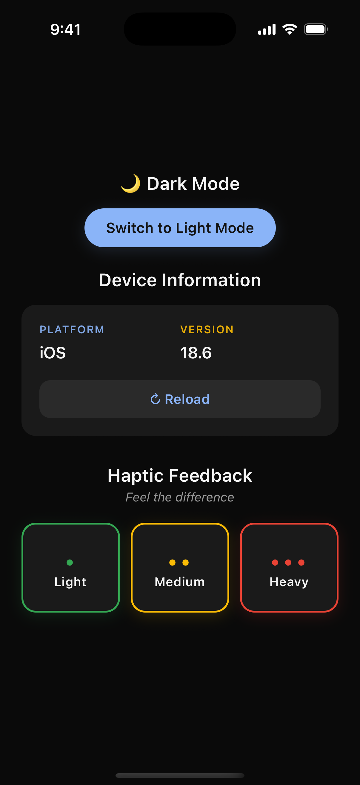
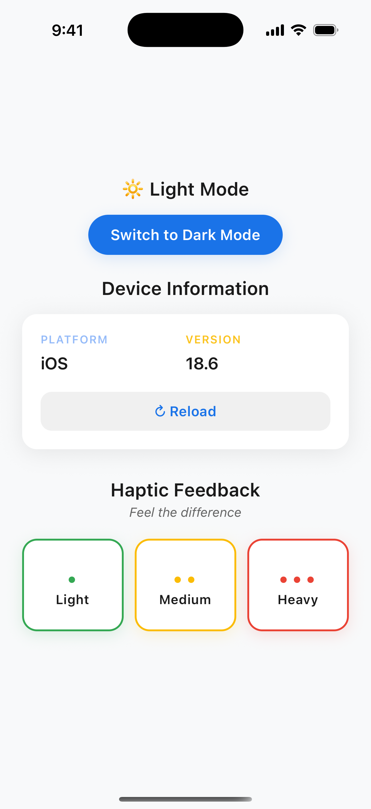

# Native Module Playground (React Native)

A React Native playground focused on **native SDK and platform integrations** using custom native modules.

This is not a production app. It exists to demonstrate how real-world mobile features are implemented when JavaScript alone isn’t enough.

 

---

## What This Project Covers

- React Native with TypeScript
- Custom native modules
  - Android (Kotlin)
  - iOS (Swift)
- Native bridging
- Platform-specific behavior with a shared TS API
- Simple UI screens to test each integration
- Light and dark mode support

---

## Implemented

- Device information via native code
- Haptics / vibration

## In Progress

- Secure storage (Keychain / Keystore)
- Additional SDK integrations added incrementally

Each feature is intentionally small and isolated to keep the native code easy to follow.

---

## Running the Project

### Install dependencies

```bash
yarn install
```

### iOS

```bash
cd ios
pod install
cd ..
yarn ios
```

### Android

```bash
yarn android
```
